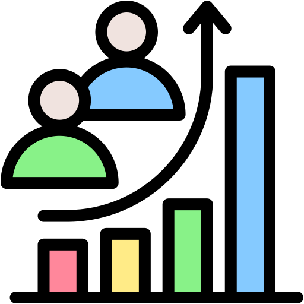

The FCC Physics Software and Computing provides a set of software packages, tools, and standards to
enable different FCC physics efforts work together. The software ecosystem of the FCC
fully employs [Key4hep](https://key4hep.github.io/key4hep-doc/)
stack and is one of its main stakeholders.

  

    

      <a href="{{ '/getting_started' | relative_url }}" class="text-decoration-none">
        

          

            
            <h4 class="card-title mb-0">Getting Started</h4>
          

        

      </a>
    

    

      <a href="{{ '/documents' | relative_url }}" class="text-decoration-none">
        

          

            
            <h4 class="card-title mb-0">Publications and Presentations</h4>
          

        

      </a>
    

    

      <a href="{{ '/software' | relative_url }}" class="text-decoration-none">
        

          

            
            <h4 class="card-title mb-0">Software</h4>
          

        

      </a>
    

    

      <a href="{{ '/computing' | relative_url }}" class="text-decoration-none">
        

          

            
            <h4 class="card-title mb-0">Analysis and Computing</h4>
          

        

      </a>
    

  

 

<h3>
Current organization
</h3>

<object data="assets/img/PSC_Organization.svg" type="image/svg+xml" width="100%"></object>

